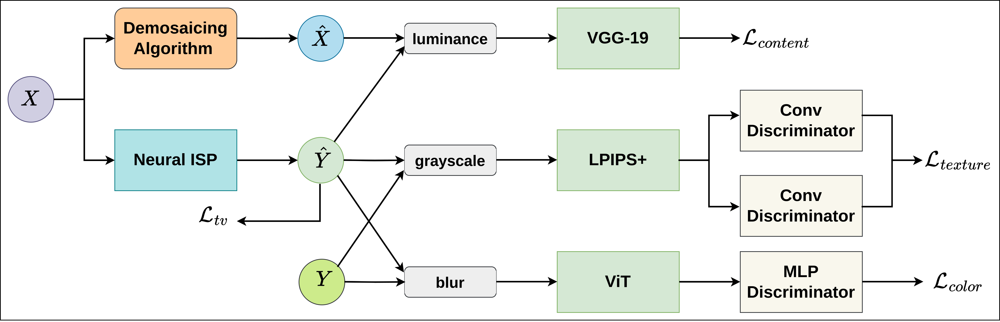

# NTIRE 2026: Learned Smartphone ISP with Unpaired Data

<div align="center">

</div>

## 📖 Challenge Overview

This repository contains the **baseline solution** for the **NTIRE 2026 Learned Smartphone ISP with Unpaired Data Challenge**.

The **Image Signal Processor (ISP)** is a critical component in modern digital cameras, converting raw sensor data into visually appealing sRGB images. While deep learning has revolutionized this field, standard approaches require large-scale **paired datasets** (pixel-aligned RAW and RGB pairs). Collecting such data is costly, difficult, and specific to each camera sensor.

**The Goal:**
This challenge invites participants to develop novel learning-based approaches that can map RAW data to the target RGB domain using **unpaired supervision**. Participants are provided with a dataset where source RAW images and target RGB images are **not pixel-aligned**.

## 🏆 Evaluation

The main goal is to achieve the highest possible image quality (fidelity of reconstruction) against a hidden ground truth.

**Metrics:**

1. **PSNR (Primary):** Peak Signal-to-Noise Ratio. Used for the final ranking.
2. **SSIM:** Structural Similarity Index.
3. **DeltaE (CIE 2000):** Measures color difference (lower is better).

## 🚀 Getting Started

### Prerequisites

* Python 3.x
* PyTorch and CUDA
* NVIDIA GPU

Install the required dependencies:

```bash
pip install -r requirements.txt

```

### Dataset

The challenge dataset consists of over 900 distinct scenes.
Please download the dataset from the [Codabench Competition Page](https://www.codabench.org/competitions/12932/).

### 🧠 Baseline Solution

The provided baseline is based on the paper **"Learned Lightweight Smartphone ISP with Unpaired Data"**. It employs a multi-term loss function guided by adversarial training with multiple discriminators to maintain content structure while learning color and texture characteristics from the target RGB dataset.

<div align="center">

</div>

## 💻 Usage

### 2. Pre-trained model

The model is available here:

- https://github.com/gosha20777/unpaired-isp-ntire-baseline/releases/tag/1.0.0

### 2. Inference (Generating Results)

To generate RGB images from RAW inputs using a trained model (or the baseline), use the `predict.py` script. This is the standard format for submission.

```bash
python predict.py --input_dir [PATH_TO_INPUT_RAWS] --output_dir [PATH_TO_SAVE_IMAGES]

```

**Example:**

```bash
python predict.py --input_dir data/test/raws --output_dir submission/

```

### 3. Training (Reproducing the Baseline)

If you wish to retrain the baseline or experiment with the architecture:

1. Configure hyperparameters in `config.py`.
2. Run the training script:
```bash
python fit.py

```

## 📜 Citation

If you use this baseline or find the paper useful, please cite:

```bibtex
@InProceedings{arhire2025learned,
    author    = {Andrei Arhire and Radu Timofte},
    title     = {Learned Lightweight Smartphone ISP with Unpaired Data},
    booktitle = {Proceedings of the IEEE/CVF Conference on Computer Vision and Pattern Recognition (CVPR) Workshops},
    month     = {June},
    year      = {2025}
}

```

## 📧 Contacts

For questions regarding the challenge organization, dataset, or technical issues, please contact:

* **Georgii Perevozchikov**: `georgii.perevozchikov@uni-wuerzburg.de`
* **Radu Timofte**: `Radu.Timofte@uni-wuerzburg.de`

---

**Acknowledgments:**
We are grateful for resources provided by [pyiqa](https://github.com/chaofengc/IQA-PyTorch), [DPED](https://github.com/aiff22/DPED), [R3GAN](https://github.com/brownvc/R3GAN), and [LAN](https://github.com/draimundo/LAN).
